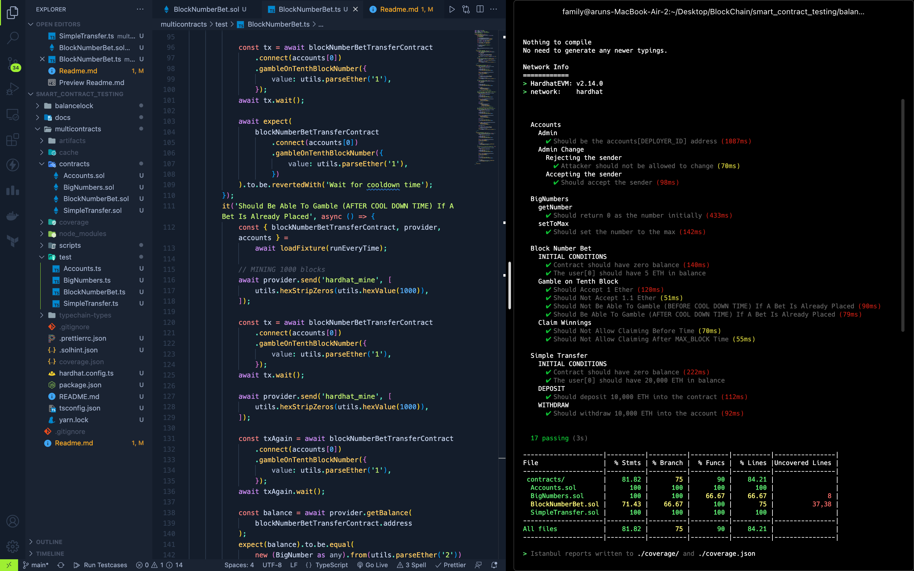

# SMART CONTRACT TESTING

</img>

This repository contains the methods of testing the contracts there are all kinds of contract variations here that covers all of the edge cases and common bug that someone may experience during the contract testing.

We can't take the security of the smart contract casually because in real world we are dealing with the real assets that have a value, if a contract is compromised then it can lead to loss of millions of dollars and thus betraying the user's trust in the crypto world.

## Build & Test

### To Build & Test the project `balancelock`

```sh
cd balancelock
yarn
yarn hardhat compile
yarn hardhat test
```

### To Build & Test the project `multicontracts`

```sh
cd multicontracts
yarn
yarn hardhat compile
yarn hardhat test
----------OR------------
yarn hardhat test test/<FILE_NAME>.ts
```

## Test Coverage Report

```sh
cd <any_project>
yarn hardhat coverage
```

### Coverage : `multicontracts`

```sh
---------------------|----------|----------|----------|----------|----------------|
File                 |  % Stmts | % Branch |  % Funcs |  % Lines |Uncovered Lines |
---------------------|----------|----------|----------|----------|----------------|
 contracts/          |    81.82 |       75 |       90 |    84.21 |                |
  Accounts.sol       |      100 |      100 |      100 |      100 |                |
  BigNumbers.sol     |      100 |      100 |    66.67 |    66.67 |              8 |
  BlockNumberBet.sol |    71.43 |    66.67 |      100 |       75 |          37,38 |
  SimpleTransfer.sol |      100 |      100 |      100 |      100 |                |
---------------------|----------|----------|----------|----------|----------------|
All files            |    81.82 |       75 |       90 |    84.21 |                |
---------------------|----------|----------|----------|----------|----------------|
```

### Coverage : `balancelock`

```sh
-------------|----------|----------|----------|----------|----------------|
File         |  % Stmts | % Branch |  % Funcs |  % Lines |Uncovered Lines |
-------------|----------|----------|----------|----------|----------------|
 contracts/  |      100 |      100 |      100 |      100 |                |
  MyTest.sol |      100 |      100 |      100 |      100 |                |
-------------|----------|----------|----------|----------|----------------|
All files    |      100 |      100 |      100 |      100 |                |
-------------|----------|----------|----------|----------|----------------|
```

Contracts Included :

- Balance Lock contract
- Multi Contracts

  - Accounts
  - BigNumber
  - Block Number Betting
  - Simple Asset Transfer

Test Focus :

- FUNCTION TESTS
- EVENTS TEST
- BALANCE CHANGE TESTS
- REVERT TESTS
- REVERT TESTING BUG
- MODIFIER TESTS
